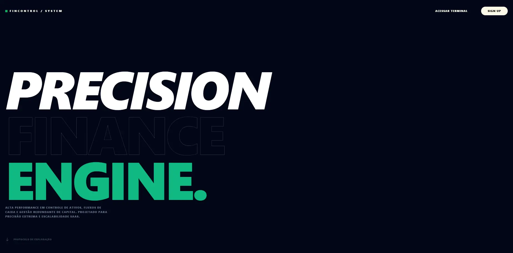
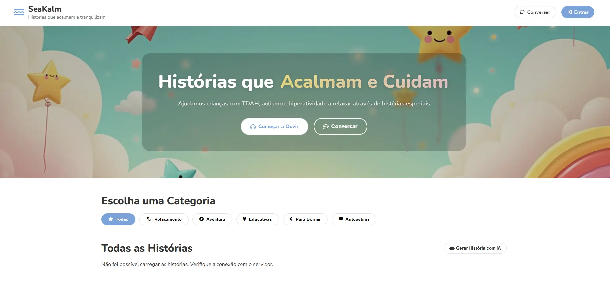
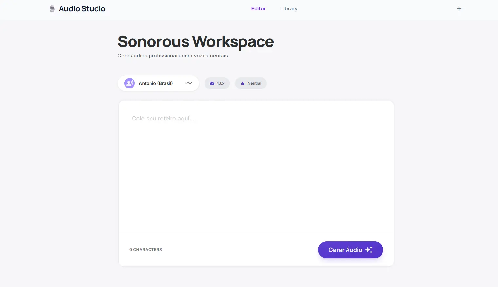
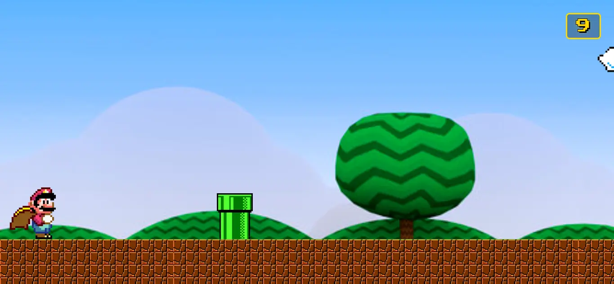

# 🚀 Portfólio JOTA | Front-End Developer

Bem-vindo ao repositório do meu portfólio pessoal. Aqui apresento meus principais projetos, tecnologias e minha trajetória como desenvolvedor Front-End Júnior.

> **Acesse o portfólio online:** [eujotaj.github.io/Portfolio/](https://eujotaj.github.io/Portfolio/)

---

## 🛠️ Sobre o Projeto

Este portfólio foi desenvolvido com foco em performance e estética moderna, utilizando **Vanilla JS** e **CSS Puro** para garantir total controle sobre as animações e o DOM, sem a sobrecarga de frameworks pesados.

- **Interface:** Glassmorphism e animações fluidas.
- **Performance:** Carregamento otimizado com SVGs nativos e Intersection Observer.
- **Responsividade:** Totalmente adaptável para dispositivos móveis e desktops.

---

## 💻 Projetos em Destaque

Abaixo estão detalhados os projetos que desenvolvi, focando em diferentes tecnologias e soluções:

| Projeto | Descrição | Tecnologias |
| :--- | :--- | :--- |
| **FinControl**    | **Plataforma de Gestão Financeira**   Um sistema robusto para visualização e controle de dados financeiros. Focado em dashboards limpos e usabilidade, permite ao usuário ter uma visão clara de sua saúde financeira. | Angular, Java |
| **SeaKalm**    | **Plataforma de Histórias Infantis**   Desenvolvido com um propósito social, o SeaKalm oferece histórias voltadas para crianças com necessidades especiais ou dificuldades de concentração, utilizando uma interface calmante e intuitiva. | Vanilla JS, CSS3 |
| **Sonorus**    | **Gerador de Áudio (Text-to-Speech)**   Uma ferramenta poderosa que converte texto em fala sem limite de caracteres. Oferece diversas opções de vozes e idiomas, ideal para acessibilidade e criação de conteúdo. | Python, HTML5 |
| **Mario Jump**    | **Jogo de Navegador**   Uma releitura do clássico "jogo do dinossauro" do Chrome, mas utilizando a temática do Super Mario. Foi um projeto focado em lógica de colisão e manipulação de estados via JavaScript. | Vanilla JS, CSS3 |

---

## 🧠 Tech Stack

Minha caixa de ferramentas inclui tecnologias modernas para o desenvolvimento de interfaces:

- **Linguagens:** JavaScript (ES6+), TypeScript, HTML5, CSS3.
- **Frameworks/Libs:** React, Angular, Tailwind CSS.
- **Outros:** Python, Integração de APIs, Git/GitHub.

---

## 🤝 Vamos nos conectar?

Estou sempre em busca de novos desafios e colaborações.

- **LinkedIn:** [Janildo Júnior (Jota)](https://www.linkedin.com/in/janildocfariasjunior/)
- **E-mail:** [jjcalluete@gmail.com](mailto:jjcalluete@gmail.com)
- **GitHub:** [@EuJotaj](https://github.com/EuJotaj)
